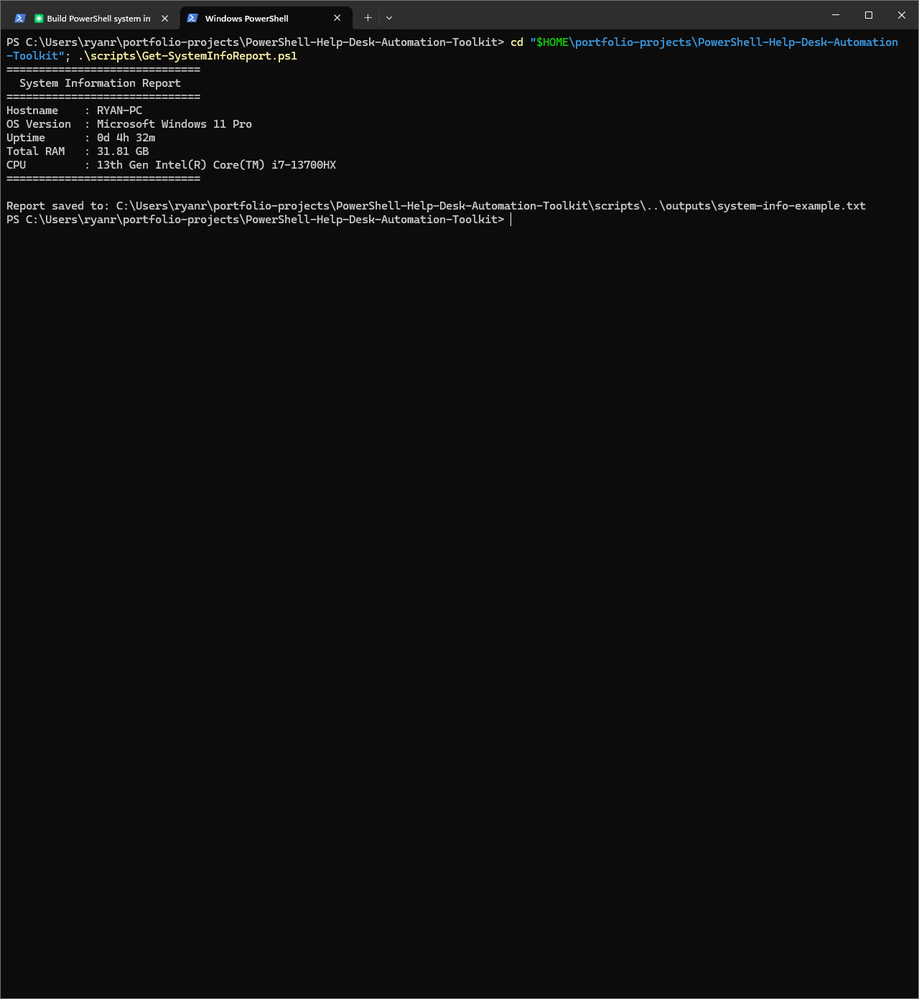

# PowerShell Help Desk Automation Toolkit

## Recruiter TL;DR

A collection of beginner-friendly PowerShell scripts that automate common help desk tasks — checking system health, reviewing disk space, testing network connectivity, and generating timestamped support reports. Built to demonstrate practical Windows endpoint skills for remote IT support roles.

---

## What This Project Proves

- I can write safe, readable PowerShell scripts without modifying systems.
- I understand what information a help desk technician needs to triage a support ticket quickly.
- I can document technical work in plain language that non-technical stakeholders can read.
- I follow a disciplined commit-and-verify workflow suitable for team environments.

---

## Skills Demonstrated

| Skill | How It Shows Up |
|---|---|
| PowerShell scripting | 5 scripts covering real help desk tasks |
| Windows endpoint knowledge | System info, disk, network, local users |
| Read-only safety discipline | No system changes without explicit approval |
| Documentation | HR-readable README, case study, resume bullets |
| Git workflow | Screenshot-backed commits at every step |

---

## Scripts

| Script | Purpose | Output | Status |
|---|---|---|---|
| `Get-SystemInfoReport.ps1` | Captures OS, hardware, and uptime info | Console + saved report | Done |
| `Get-DiskSpaceReport.ps1` | Reviews all drives and flags low-space volumes | Console + saved report | Planned |
| `Test-NetworkConnectivity.ps1` | Pings gateway, DNS, and internet; tests resolution | Console | Planned |
| `Get-LocalUserSummary.ps1` | Lists local accounts and enabled/disabled status | Console + saved report | Planned |
| `New-SupportReport.ps1` | Bundles all checks into one timestamped support report | Saved report file | Planned |

> Scripts are read-only. None modify system settings, user accounts, or files.

---

## Screenshot Walkthrough

*Screenshots will be added here as each script is built and tested. Each image includes a plain-language explanation of what a recruiter or hiring manager is looking at.*

<!-- 00-repo-setup.png -->

### Script 1 — System Information Report

Running `Get-SystemInfoReport.ps1` pulls key system details — machine name, OS version, how long it's been running, memory, and processor — and saves them to a text file. A help desk tech would run this at the start of a support call to quickly understand the endpoint before troubleshooting.

<!-- 02-disk-space-script-output.png -->
<!-- 03-network-connectivity-script-output.png -->
<!-- 04-local-user-summary-output.png -->
<!-- 05-support-report-created-output.png -->

---

## Example Support Scenarios

**Scenario 1 — "My computer is running slow"**
Run `Get-SystemInfoReport.ps1` and `Get-DiskSpaceReport.ps1` to check uptime, memory, and disk usage before escalating.

**Scenario 2 — "I can't reach the shared drive"**
Run `Test-NetworkConnectivity.ps1` to confirm gateway reachability, DNS resolution, and internet access in under 30 seconds.

**Scenario 3 — "Prepare this ticket for escalation"**
Run `New-SupportReport.ps1` to generate a clean, timestamped report the next-tier tech can open immediately.

---

## Safety Notes

- All scripts run as read-only by default. No files are modified, deleted, or created outside the `outputs/reports/` folder.
- Scripts do not collect credentials, passwords, or personal files.
- Example output files contain generic placeholder data — no real machine names, usernames, or IP addresses are committed to this repo.
- Screenshots are reviewed and cropped before being added to ensure no private information is visible.

---

## How to Run Locally

1. Clone this repo: `git clone https://github.com/yourusername/PowerShell-Help-Desk-Automation-Toolkit`
2. Open PowerShell (no admin required for read-only scripts).
3. Navigate to the `scripts/` folder: `cd .\scripts\`
4. Run any script: `.\Get-SystemInfoReport.ps1`
5. Review output in the console or check `outputs/reports/` for saved files.

> Tested on Windows 10 and Windows 11. PowerShell 5.1+.

---

## Documentation

- [Case Study](case-study.md) — walkthrough of the project from a help desk technician's perspective
- [Resume Bullets](resume-bullets.md) — ready-to-paste bullet points for IT support job applications

---

*Built by Ryan Frechette — IT support professional building a practical PowerShell automation portfolio.*
