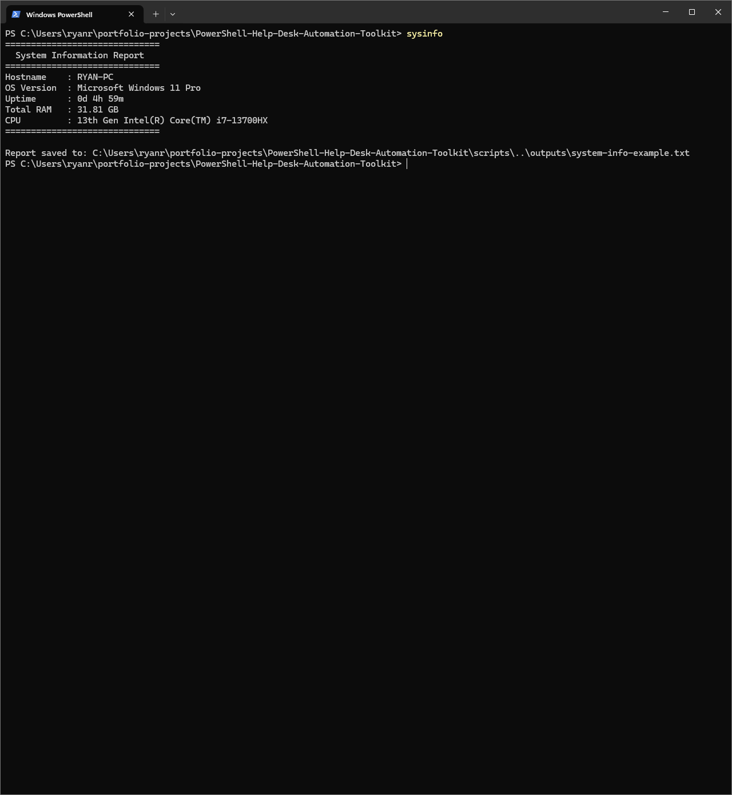

# PowerShell Help Desk Automation Toolkit

## Recruiter TL;DR

A screenshot-backed PowerShell portfolio project that automates common Windows help desk checks: system information, disk space, network connectivity, local user review, support report generation, and recent event log errors. Built to demonstrate practical Windows endpoint support skills for remote help desk and junior IT support roles.

## Quick Start - Command Shortcuts

| Command | What It Runs | What It Checks |
|---|---|---|
| `sysinfo` | `Get-SystemInfoReport.ps1` | Hostname, OS, uptime, RAM, CPU |
| `diskreport` | `Get-DiskSpaceReport.ps1` | Drive size, free space, percent free, low-space status |
| `netcheck` | `Test-NetworkConnectivity.ps1` | Gateway, DNS server, internet IP, DNS resolution |
| `usersummary` | `Get-LocalUserSummary.ps1` | Local users, enabled status, last logon, password requirement |
| `supportreport` | `New-SupportReport.ps1` | Combined timestamped support report |
| `eventerrors` | `Get-RecentEventLogErrors.ps1` | Recent System and Application errors without message bodies |

## What This Project Proves

- Built safe, readable PowerShell scripts for common first-level Windows support checks.
- Created repeatable troubleshooting commands that save console output into report files.
- Documented each workflow with screenshots so a hiring manager can verify the work quickly.
- Used Git and GitHub to commit, push, and polish a complete technical portfolio project.

## Skills Demonstrated

| Skill | How It Shows Up |
|---|---|
| PowerShell scripting | Six scripts covering real help desk tasks |
| Windows endpoint troubleshooting | System info, disk, network, local users, event logs |
| Read-only safety discipline | Scripts avoid destructive commands and system changes |
| Technical documentation | HR-readable README, case study, resume bullets, screenshots |
| Git/GitHub workflow | Screenshot-backed commits and pushed proof of work |

## Scripts

| Script | Command | Purpose | Output | Status |
|---|---|---|---|---|
| `Get-SystemInfoReport.ps1` | `sysinfo` | Captures hostname, OS, uptime, RAM, and CPU | Console + saved report | Done |
| `Get-DiskSpaceReport.ps1` | `diskreport` | Reviews drive size, free space, percent free, and low-space status | Console + saved report | Done |
| `Test-NetworkConnectivity.ps1` | `netcheck` | Checks gateway, DNS server, internet IP, and DNS resolution | Console + saved report | Done |
| `Get-LocalUserSummary.ps1` | `usersummary` | Lists local accounts, enabled status, last logon, and password requirement | Console + saved report | Done |
| `New-SupportReport.ps1` | `supportreport` | Combines core checks into one timestamped support report | Saved report file | Done |
| `Get-RecentEventLogErrors.ps1` | `eventerrors` | Reviews recent System and Application errors while omitting message bodies | Console + saved report | Done |

> These scripts are read-only and designed for portfolio demonstration, first-level troubleshooting practice, and escalation documentation.

## Screenshot Walkthrough

Each screenshot shows the command, terminal output, and saved report path. This gives hiring managers proof that the scripts were run locally and produce real support-style output.

### Phase 1 - System Information Report

Shows the `sysinfo` command collecting core endpoint details a help desk technician would gather at the start of a ticket: hostname, OS version, uptime, RAM, and CPU.

### Phase 2 - Disk Space Report

Shows the `diskreport` command checking drive capacity, free space, percent free, and low-space status for storage and performance troubleshooting.

### Phase 3 - Network Connectivity Report

Shows the `netcheck` command verifying gateway, DNS server, internet IP connectivity, and DNS resolution.

### Phase 4 - Local User Summary Report

Shows the `usersummary` command reviewing local Windows accounts, enabled status, last logon, and password requirement.

### Phase 5 - Support Report Generator

Shows the `supportreport` command combining system info, disk space, network checks, and local user review into one timestamped help desk escalation report.

### Phase 6 - Recent Event Log Errors

Shows the `eventerrors` command reviewing recent System and Application error events while omitting message bodies to reduce private data exposure.

## Example Support Scenarios

**Scenario 1 - Computer running slow**  
Run `sysinfo` and `diskreport` to check uptime, memory, CPU, disk usage, and low-space status.

**Scenario 2 - Cannot reach websites or shared resources**  
Run `netcheck` to verify gateway reachability, DNS server response, internet IP connectivity, and DNS resolution.

**Scenario 3 - Account review needed**  
Run `usersummary` to review local accounts, enabled status, last logon, and password requirement.

**Scenario 4 - Ticket escalation**  
Run `supportreport` to generate a timestamped support report that can be attached to a ticket or sent to a higher support tier.

**Scenario 5 - Recent errors after a crash or issue**  
Run `eventerrors` to review recent high-level System and Application errors without exposing full event message bodies.

## Safety Notes

- Scripts are read-only and avoid destructive commands.
- Scripts save output only inside the repo `outputs/` folder.
- Event log message bodies are omitted to reduce private data exposure.
- Screenshots were captured from a personal lab machine and reviewed before being added.
- This is a portfolio project, not an enterprise monitoring tool.

## How to Run Locally

1. Clone this repo: `git clone https://github.com/RyanRFrechette/PowerShell-Help-Desk-Automation-Toolkit.git`
2. Open PowerShell.
3. Navigate to the project folder.
4. Run a script from the `scripts/` folder, for example: `.\scripts\Get-SystemInfoReport.ps1`
5. Review console output or saved reports in `outputs/`.

## Documentation

- [Case Study](case-study.md)
- [Resume Bullets](resume-bullets.md)
- [LinkedIn Post](linkedin-post.md)

## Project Status

Complete. Core scripts, optional event log script, saved outputs, screenshot walkthrough, case study, resume bullets, and LinkedIn post are included.

Built by Ryan Frechette as a practical PowerShell automation portfolio project for help desk and IT support roles.
