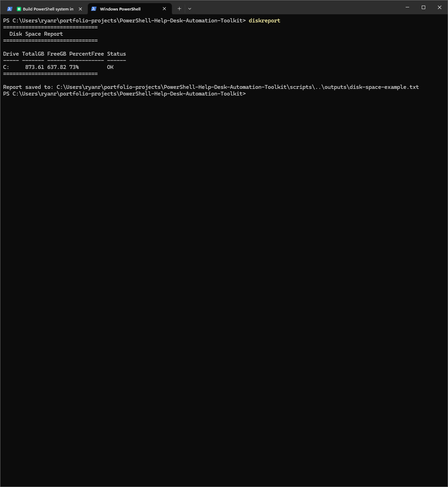
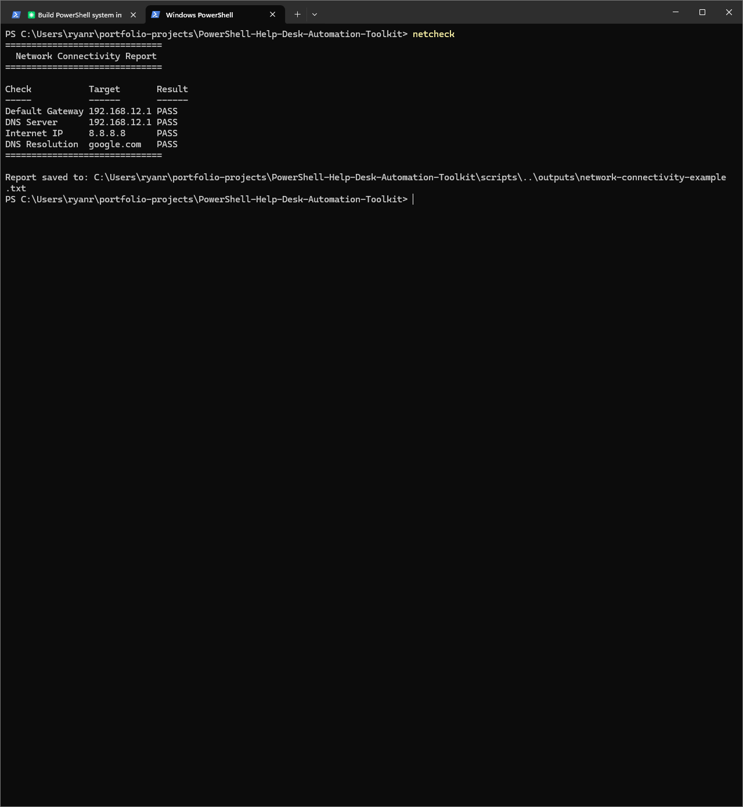
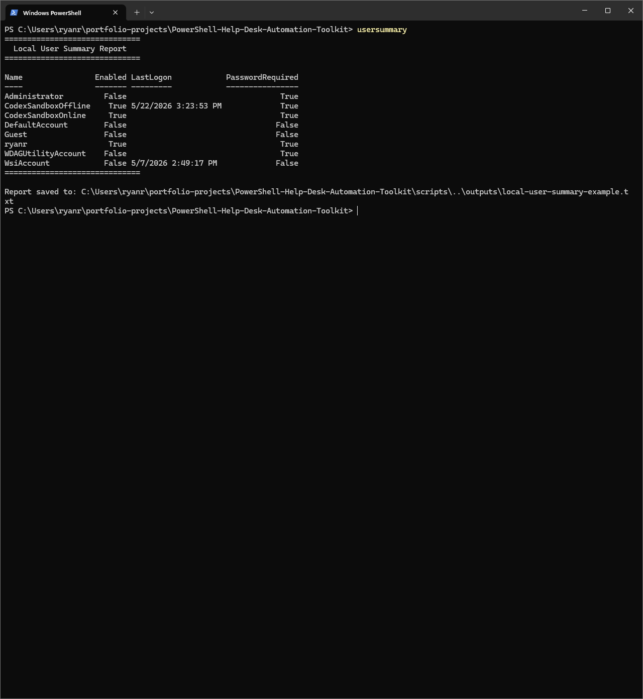
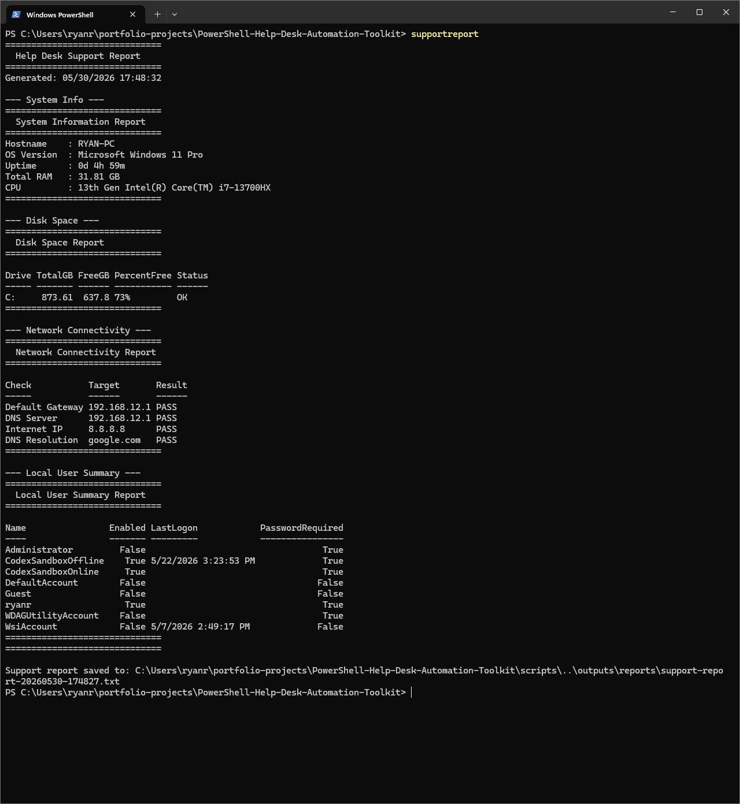
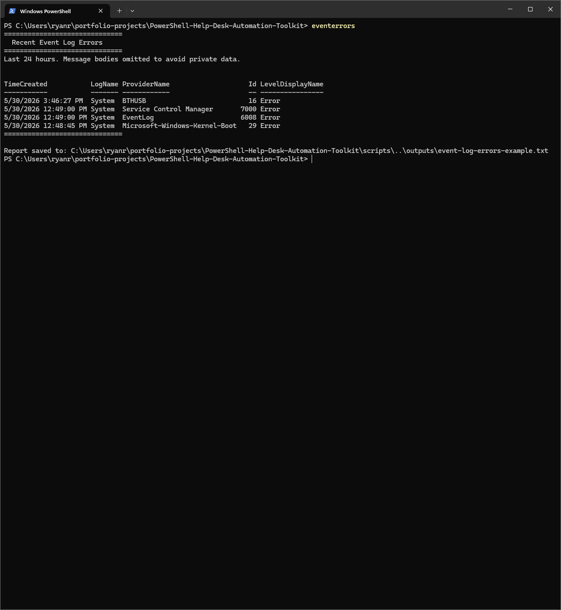

# PowerShell Help Desk Automation Toolkit

## Recruiter TL;DR

A beginner-friendly PowerShell portfolio project that automates common Windows help desk checks: system information, disk space, network connectivity, local user review, support report generation, and recent event log errors. Built to demonstrate practical Windows endpoint support skills for remote IT support roles.

## What This Project Proves

- I can write safe, readable PowerShell scripts without modifying systems.
- I understand the first checks a help desk technician runs during triage.
- I can document technical work clearly for non-technical hiring managers.
- I can build a screenshot-backed GitHub project with repeatable commands and saved outputs.

## Skills Demonstrated

| Skill | How It Shows Up |
|---|---|
| PowerShell scripting | Six scripts covering real help desk tasks |
| Windows endpoint troubleshooting | System info, disk, network, local users, event logs |
| Read-only safety discipline | No destructive system changes |
| Documentation | HR-readable README, case study, resume bullets |
| Git workflow | Screenshot-backed commits and pushed proof |

## Scripts

| Script | Purpose | Output | Status |
|---|---|---|---|
| `Get-SystemInfoReport.ps1` | Captures hostname, OS, uptime, RAM, and CPU | Console + saved report | Done |
| `Get-DiskSpaceReport.ps1` | Reviews drive size, free space, percent free, and low-space status | Console + saved report | Done |
| `Test-NetworkConnectivity.ps1` | Checks gateway, DNS server, internet IP, and DNS resolution | Console + saved report | Done |
| `Get-LocalUserSummary.ps1` | Lists local accounts, enabled status, last logon, and password requirement | Console + saved report | Done |
| `New-SupportReport.ps1` | Combines the core checks into one timestamped support report | Saved report file | Done |
| `Get-RecentEventLogErrors.ps1` | Reviews recent System and Application errors while omitting message bodies | Console + saved report | Done |

> Scripts are read-only. They are designed for portfolio demonstration and first-level troubleshooting practice.

## Screenshot Walkthrough

### Phase 1 - System Information Report

Shows the `sysinfo` command collecting core endpoint details a help desk technician would gather at the start of a ticket: hostname, OS version, uptime, RAM, and CPU.

### Phase 2 - Disk Space Report

Shows drive capacity, free space, percent free, and low-space status for storage and performance troubleshooting.

### Phase 3 - Network Connectivity Report

Shows the `netcheck` command verifying gateway, DNS server, internet IP connectivity, and DNS resolution.

### Phase 4 - Local User Summary Report

Shows the `usersummary` command reviewing local Windows accounts, enabled status, last logon, and password requirement.

### Phase 5 - Support Report Generator

Shows the `supportreport` command combining system info, disk space, network checks, and local user review into one timestamped help desk escalation report.

### Phase 6 - Recent Event Log Errors

Shows the `eventerrors` command reviewing recent System and Application error events while omitting message bodies to reduce private data exposure.

## Example Support Scenarios

**Scenario 1 - Computer running slow**  
Run `Get-SystemInfoReport.ps1` and `Get-DiskSpaceReport.ps1` to check uptime, memory, CPU, and disk usage.

**Scenario 2 - Cannot reach websites or shared resources**  
Run `Test-NetworkConnectivity.ps1` or the `netcheck` shortcut to verify gateway, DNS, internet IP, and DNS resolution.

**Scenario 3 - Account review needed**  
Run `Get-LocalUserSummary.ps1` or the `usersummary` shortcut to review local accounts and enabled status.

**Scenario 4 - Ticket escalation**  
Run `New-SupportReport.ps1` or the `supportreport` shortcut to generate a timestamped support report.

**Scenario 5 - Recent errors after a crash or issue**  
Run `Get-RecentEventLogErrors.ps1` or the `eventerrors` shortcut to review recent high-level errors without exposing full event messages.

## Safety Notes

- Scripts are read-only and avoid destructive commands.
- Scripts save output only inside the repo `outputs/` folder.
- Event log message bodies are omitted to reduce private data exposure.
- Screenshots are included as public proof of work.
- This is a portfolio project, not an enterprise monitoring tool.

## How to Run Locally

1. Clone this repo: `git clone https://github.com/RyanRFrechette/PowerShell-Help-Desk-Automation-Toolkit.git`
2. Open PowerShell.
3. Navigate to the project folder.
4. Run a script from the `scripts/` folder, for example: `.\scripts\Get-SystemInfoReport.ps1`
5. Review console output or saved reports in `outputs/`.

## Documentation

- [Case Study](case-study.md)
- [Resume Bullets](resume-bullets.md)
- [LinkedIn Post](linkedin-post.md)

## Project Status

Core project complete. Optional event log bonus script added. Final review completed after fixing README encoding issues and restoring the full screenshot walkthrough.

Built by Ryan Frechette as a practical PowerShell automation portfolio project for help desk and IT support roles.

